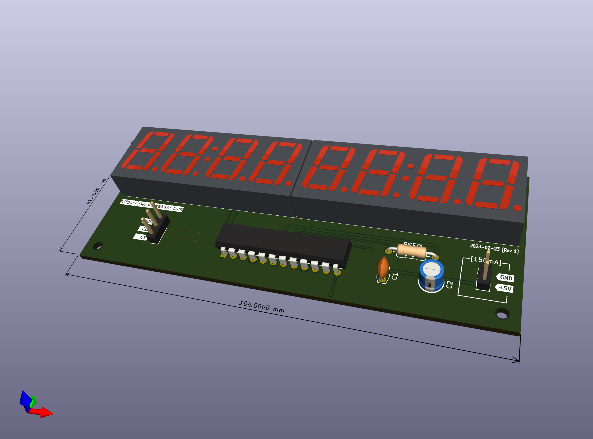

# Introduction
A driver to control one or more [MAX7219 / MAX7221](https://www.analog.com/en/products/MAX7219.html) serially interfaced, 8-Digit, LED Display Drivers [](https://components.espressif.com/components/gilleszunino/max7219_7221)

## Usage
MAX7219 / MAX7221 devices are controlled via Serial Peripheral Interface (SPI) and can be cascaded. Follow these steps to use the driver:
1. Initialize an SPI master via `spi_bus_initialize()`. Most applications choose `SPI2_HOST` however other hosts should work,
2. Initialize the MAX7219 / MAX7221 driver by calling `led_driver_max7219_init()` and providing the number of devices, desired SPI frequency ... ,
3. Configure MAX7219 / MAX7221 device(s) for a specific application by calling one or more `led_driver_max7219_set_xxx` or `led_driver_max7219_configure_xxx` functions:
    * `led_driver_max7219_set_chain_mode()` / `led_driver_max7219_set_mode()` to configure the device mode,
    * `led_driver_max7219_configure_chain_decode()` / `led_driver_max7219_configure_decode()` to configure decode mode,
    * `led_driver_max7219_set_chain_intensity()` / `led_driver_max7219_set_intensity()` to change display intensity,
    * `led_driver_max7219_configure_chain_scan_limit()` / `led_driver_max7219_configure_scan_limit` to configure scan limit.
4. Turn LEDs on / off on one or more MAX7219 / MAX7221 device(s) with one of the following:
    * `led_driver_max7219_set_chain()` / `led_driver_max7219_set_digit()` / `led_driver_max7219_set_digits()` to set all / one / n digits on the chain
5. Shutdown the driver by calling `led_driver_max7219_free()` and optionally shut down the SPI master with `spi_bus_free()`.

### Initializing SPI
Before using any `led_driver_max7219_xxx` function, an **SPI master** needs to be initialized. This can be achieved as follows:

```c
// SPI Host ID
const spi_host_device_t SPI_HOSTID = SPI2_HOST;

//
// GPIO pins to use for SPI
// NOTE: For maximum performance, prefer IO MUX over GPIO Matrix routing
//  * See https://docs.espressif.com/projects/esp-idf/en/latest/esp32/api-reference/peripherals/spi_master.html#gpio-matrix-routing
//
const gpio_num_t CS_LOAD_PIN = GPIO_NUM_19;
const gpio_num_t CLK_PIN = GPIO_NUM_18;
const gpio_num_t DIN_PIN = GPIO_NUM_16;

spi_bus_config_t spiBusConfig = {
    .mosi_io_num = DIN_PIN,
    .miso_io_num = GPIO_NUM_NC,
    .sclk_io_num = CLK_PIN,

    .data2_io_num = GPIO_NUM_NC,
    .data3_io_num = GPIO_NUM_NC,

    .max_transfer_sz = SOC_SPI_MAXIMUM_BUFFER_SIZE,
    .flags = SPICOMMON_BUSFLAG_MASTER,
    .isr_cpu_id = ESP_INTR_CPU_AFFINITY_AUTO
};
ESP_ERROR_CHECK(spi_bus_initialize(SPI_HOSTID, &spiBusConfig, SPI_DMA_CH_AUTO));
```

We initialize `SPI2_HOST` as SPI master (`SPICOMMON_BUSFLAG_MASTER`) and request ESP-IDF to automatically choose the DMA channel (`SPI_DMA_CH_AUTO`).

### Initializing the driver and defining the chain topology
Next, we initialize the MAX7219 / MAX7221 driver by specifying the SPI master host we just initialized, clock source, frequency (MAX7219 / MAX7221 support a maximum of 10MHz), SPI queue size and chain length. The chain length defines how many physical MAX7219 / MAX7221 devices are cascaded via the `DOUT` pin. See data sheet for more information on cascading MAX7219 / MAX7221 devices and for sample schematics. The driver currently supports a maximum of 255 cascaded devices in a single chain. The field `.chain_length` must be a `uint8_t` in the range [1..255].

```c
// Number of devices MAX 7219 / 7221 in the chain
const uint8_t ChainLength = 3;

// Handle to the MAX 7219 / 7221 driver
led_driver_max7219_handle_t led_max7219_handle = NULL;

max7219_config_t max7219InitConfig = {
    .spi_cfg = {
        .host_id = SPI_HOSTID,

        .clock_source = SPI_CLK_SRC_DEFAULT,
        .clock_speed_hz = 10 * 1000000,

        .spics_io_num = CS_LOAD_PIN,
        .queue_size = 8
    },
    .hw_config = {
        .chain_length = ChainLength
    }
};
ESP_ERROR_CHECK(led_driver_max7219_init(&max7219InitConfig, &led_max7219_handle));
```

### Working with the chain
The driver allows users to control all MAX7219 / MAX7221 devices on the chain at once or control a specific MAX7219 / MAX7221 device. Functions named `led_driver_max7219_chain_xxx` (aka `led_driver_max7219_set_chain_mode()`) operate on all devices at once while functions accepting a `uint8_t chainId` (aka `led_driver_max7219_set_mode()`) target a specific MAX7219 / MAX7221 device. **The chain is one based**. The first device in the chain has `chainId = 1`, the second device `chainId = 2` and so on.

#### Configuring mode of operation
A MAX7219 / MAX7221 device can operate in three distinct modes:
* **Shutdown** mode: All digits are hidden. The device retains its configuration and can be programmed. This is the default mode at power on,
* **Normal** mode: Digits are displayed, the device is programmable and any change is visible immediately,
* **Test** mode: All segments on all digits are lit to maximum intensity. The device retains its configuration.

At power on, all MAX7219 / MAX7221 devices enter **shutdown** mode. The chain is typically configured (set scan limit, intensity, decode ...) in shutdown mode. When one-time configuration is complete, MAX7219 / MAX7221 devices are then put in **normal** mode to display digits. Alternatively, MAX7219 / MAX7221 devices can be switched to test mode until there is data ready to display.

The mode of operation is configured as follows:
```c
// Configure Normal mode for all MAX7219 / MAX7221 devices in the chain
ESP_ERROR_CHECK(led_driver_max7219_set_chain_mode(led_max7219_handle, MAX7219_NORMAL_MODE));

...

// Configure Normal mode for the second (2) MAX7219 / MAX7221 device on the chain
ESP_ERROR_CHECK(led_driver_max7219_set_mode(led_max7219_handle, 2, MAX7219_NORMAL_MODE));
```

### Displaying digits
There are three steps to turning on LEDs on a given MAX7219 / MAX7221 device:
1. Choose the format ('decode mode') used to describe which LEDs are on. This is typically done once during MAX7219 / MAX7221 chain initialization, even though the decode mode can be changed at any time,
2. Send one or more symbol codes to the MAX7219 / MAX7221 chain or to a specific MAX7219 / MAX7221 device. A symbol code is a `uint8_t` describing which LED is on. This value is decode mode dependent.

#### Choosing and configuring the decode mode
MAX7219 / MAX7221 devices support two different decoding modes:
* **Code-B** (Code-B decode): LEDs to be turned on are expressed as BCD code B values (0-9, E, H, L, P, and -). This is useful for applications keeping data to display in BCD,
* **Direct Addressing** (no decode): LEDs are controlled via direct addressing. In direct addressing, each individual LED is assigned a mask and various masks are combined (or'ed together) to produce a symbol code. See 'Symbols codes' below or the MAX7219 / MAX7221 data sheet for more details. This is the default mode on MAX7219 / MAX7221 power on.

Each MAX7219 / MAX7221 device controls up to eight groups of eight LEDs. These LEDs are typically arranged as eight digits each composed of seven segments and a decimal point as shown in the picture below:



However, LEDs can be arranged in any shape or form. Other popular arrangements include a matrix of 64 LEDs or [Sixteen-segment displays](https://en.wikipedia.org/wiki/Sixteen-segment_display). Each digit (a group of nine LEDs) can be configured for either Code-B or Direct Addressing.

The desired decode mode is set by combining (or'ing together) one or more `MAX7219_CODE_B_DECODE_DIGIT_x` constant. For instance configure digit 1 and digit 3 for Code-B and all other digits for direct addressing with `MAX7219_CODE_B_DECODE_DIGIT_1 | MAX7219_CODE_B_DECODE_DIGIT_3`. The following constants make it easier to configure all digits for Code-B or direct addressing:
1. `MAX7219_CODE_B_DECODE_ALL` configures all digits as Code-B,
2. `MAX7219_CODE_B_DECODE_NONE` configures all digits as direct addressing.

The code to configure decode mode is as follows:
```c
// Configure Code-B decode for all digits on all MAX7219 / MAX7221 devices in the chain 
led_driver_max7219_configure_chain_decode(led_max7219_handle, MAX7219_CODE_B_DECODE_ALL)

...

// Configure Code-B decode for digits 1, 2 and 5 on all MAX7219 / MAX7221 devices in the chain 
led_driver_max7219_configure_chain_decode(led_max7219_handle, MAX7219_CODE_B_DECODE_DIGIT_1 | MAX7219_CODE_B_DECODE_DIGIT_2 | MAX7219_CODE_B_DECODE_DIGIT_5)

...

// Configure Code-B decode for digits 1, 2 and 5 on the second (2) MAX7219 / MAX7221 device on the chain
ESP_ERROR_CHECK(led_driver_max7219_configure_decode(led_max7219_handle, 2, MAX7219_CODE_B_DECODE_DIGIT_1 | MAX7219_CODE_B_DECODE_DIGIT_2 | MAX7219_CODE_B_DECODE_DIGIT_5));
```

##### Symbol codes for Code-B and Direct Addressing
The driver header file offers convenient constants for both Code-B symbols and direct addressing symbols:

* Code-B: `MAX7219_CODE_B_0` to `MAX7219_CODE_BLANK`. To enable the decimal point, combine a character with `MAX7219_CODE_B_DP_MASK` as in `MAX7219_CODE_B_0 | MAX7219_CODE_B_DP_MASK`
* Direct Addressing offers two sets of constants:
    * Individual LEDs: `MAX7219_SEGMENT_A` to `MAX7219_SEGMENT_G` with `MAX7219_SEGMENT_DP` as the mask for the decimal point,
    * Predefined letters, numbers and symbols: `MAX7219_CUSTOM_0` to `MAX7219_CUSTOM_BLANK` with `MAX7219_SEGMENT_DP` as the mask for the decimal point.

#### Turning LEDs on or off
Once a decode mode has been chosen, symbol codes can be sent to the chain as follows:
```c
// Assume Code-B decode for all digits and set digit 1 to 'E' on all on all MAX7219 / MAX7221 devices in the chain
ESP_ERROR_CHECK(led_driver_max7219_set_chain(led_max7219_handle, 1, MAX7219_CODE_B_E));

...

// Assume Code-B decode for all digits and set digit 1 to 'E' on the second (2) MAX7219 / MAX7221 device
ESP_ERROR_CHECK(led_driver_max7219_set_digit(led_max7219_handle, 2, 1, MAX7219_CODE_B_E));

...

// Assume direct addressing for all digits and set digit 1 to 'E' on all on all MAX7219 / MAX7221 devices in the chain
ESP_ERROR_CHECK(led_driver_max7219_set_chain(led_max7219_handle, 1, MAX7219_DIRECT_ADDRESSING_E));

...

// Assume direct addressing for all digits and set digit 1 to 'E' on the second (2) MAX7219 / MAX7221 device
ESP_ERROR_CHECK(led_driver_max7219_set_digit(led_max7219_handle, 2, 1, MAX7219_DIRECT_ADDRESSING_E));
```

It is also possible to set several digits across one or more devices on the chain as follows:
```c
const uint8_t symbolsCount = 5;
const uint8_t symbols[] = { MAX7219_DIRECT_ADDRESSING_H, MAX7219_DIRECT_ADDRESSING_E, MAX7219_DIRECT_ADDRESSING_L, MAX7219_DIRECT_ADDRESSING_L, MAX7219_DIRECT_ADDRESSING_0 };

// Assume direct addressing for all digits and display 'HELL0' starting at digit 3 of the second (2) MAX7219 / MAX7221 device
ESP_ERROR_CHECK(led_driver_max7219_set_digits(led_max7219_handle, 2, 3, symbols, symbolsCount));
```

Finally, a specific segment / LED can be turned on as follows:
```c
// Assume direct addressing for all digits and turn on segment 'A' and decimal point on all MAX7219 / MAX7221 devices in the chain
ESP_ERROR_CHECK(led_driver_max7219_set_chain(led_max7219_handle, 1, MAX7219_SEGMENT_A | MAX7219_SEGMENT_DP));
```

### Configuring display intensity
MAX7219 / MAX7221 devices allow LEDs brightness control. The brightness is always set for all LEDs and is a two-step operation:
1. Hardware control: Connect a fixed (or variable) resistor RSET between V+ and ISET. Refer to the data sheet for instructions on how to calculate RSET,
2. Digital control: An internal PWM scales the average segment current in 16 steps from a maximum of 31/32 down to 1/32 of the peak current set by RSET (15/16 to 1/16 on MAX7221).

The driver enables digital brightness control. Digital display intensity can be changed at any time. It is also possible to create a fade effect by reducing or increasing intensity over a short period of time. Intensity PWM is programmatically controlled as follows:
```c
// Configure PWM to 2/16 for all MAX7221 devices in the chain
ESP_ERROR_CHECK(led_driver_max7219_set_chain_intensity(led_max7219_handle, MAX7219_INTENSITY_DUTY_CYCLE_STEP_2));

...

// Configure PWM to 5/32 for the second (2) MAX7221 device on the chain
ESP_ERROR_CHECK(led_driver_max7219_set_intensity(led_max7219_handle,2,  MAX7219_INTENSITY_DUTY_CYCLE_STEP_3));
```

### Configuring scan limit
MAX7219 / MAX7221 devices allow configuring how many digits are displayed from 1 to 8. If the scan limit is set for three digits or less, individual digit drivers will dissipate excessive amounts of power. Consequently, the value of the RSET resistor must be adjusted according to the number of digits displayed, to limit individual digit driver power dissipation. Scan limit should not be used for leading '0' suppression. Refer to the data sheet for additional information.

It is possible to configure scan limit per device on a chain. However, the data sheet recommends configuring all MAX7219 / MAX7221 devices with the same scan limit.

Scan limit can be configured as follows:
```c
// Configure scan limit to 4 digits for all MAX7221 devices in the chain
ESP_ERROR_CHECK(led_driver_max7219_configure_chain_scan_limit(led_max7219_handle, 4));

...

// Configure scan limit to 4 digits for the second (2) MAX7221 device on the chain
ESP_ERROR_CHECK(led_driver_max7219_configure_scan_limit(led_max7219_handle, 2, 4));
```

### Using test mode
MAX7219 / MAX7221 devices include a test mode. In test mode, all LEDs are turned on by overriding, but not altering, all controls and digits (including the shutdown mode). In test mode, 8 digits are scanned and the duty cycle is 31/32 (15/16 for MAX7221).

Test mode can be entered as follows:
```c
// Configure Test mode for all MAX7219 / MAX7221 devices in the chain
ESP_ERROR_CHECK(led_driver_max7219_set_chain_mode(led_max7219_handle, MAX7219_TEST_MODE));

...

// Configure Test mode for the second (2) MAX7219 / MAX7221 device on the chain
ESP_ERROR_CHECK(led_driver_max7219_set_mode(led_max7219_handle, 2, MAX7219_TEST_MODE));
```

## Thread Safety
All driver functions are thread safe with the exception of `led_driver_max7219_init()` and `led_driver_max7219_free()`. Internally, each instance of the driver has a global semaphore which is acquired after validating arguments and before accessing any SPI function. 

The driver supports multiple instances of `led_driver_max7219_handle_t`. Currently, all `led_driver_max7219_handle_t` instances must be accessed by the same FreeRTOS task.  

## Samples
Several samples are located under `examples`. This section lists samples and capabilities demonstrated. Refer to a sample `README.md` file for more details.
* [`max_7219_7221_basic`](./examples/max7219_7221_basic/README.md) demonstrates how to initialize, configure a single MAX7219 / MAX7221 device and display symbols. This is a good starting point for new users,
* [`max_7219_7221_cascade`](./examples/max7219_7221_cascade/README.md) demonstrates how to initialize, configure a chain of three MAX7219 / MAX7221 cascaded devices and display symbols,
* [`max_7219_7221_decode`](./examples/max7219_7221_decode/README.md) demonstrates how to initialize, configure a single MAX7219 / MAX7221 device and set per digit decode mode,
* [`max_7219_7221_intensity`](./examples/max7219_7221_intensity/README.md) demonstrates how to control display intensity,
* [`max_7219_7221_scanlimit`](./examples/max7219_7221_scanlimit/README.md) demonstrates how to control scan limit (how many digits are active on a given MAX7219 / MAX7221 device),
* [`max_7219_7221_temperature`](./examples/max7219_7221_temperature/README.md) demonstrates how to display the current ESP32 device temperature, minimum and maximum,
* [`max_7219_7221_testmode`](./examples/max7219_7221_testmode/README.md) demonstrates how to control test mode.